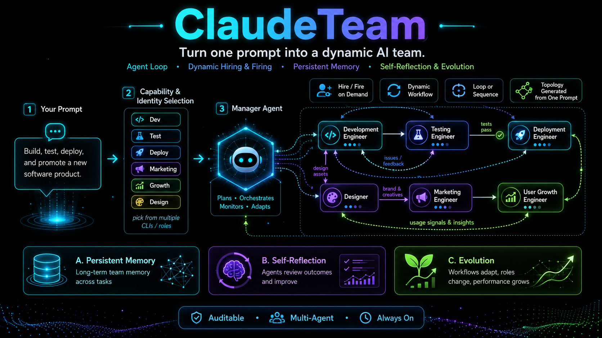
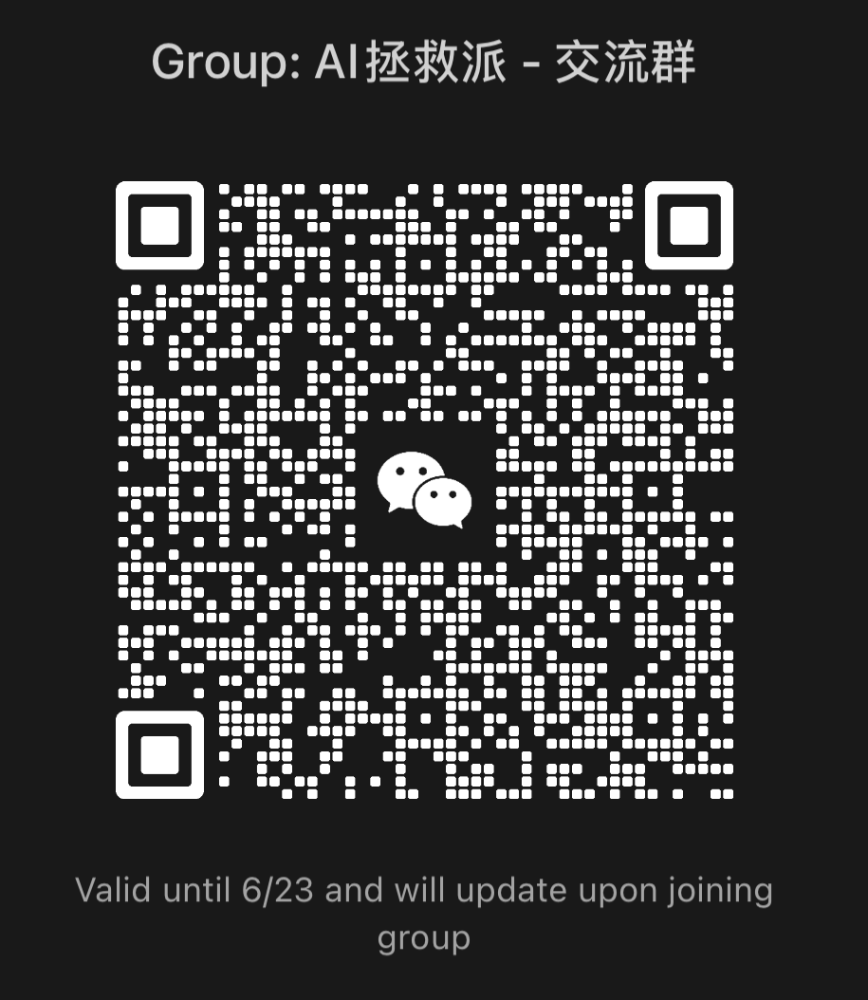

<p align="center">
  <a href="../README.md">English</a> · <b>简体中文</b>
</p>

<p align="center">
  
</p>

<p align="center">
  <a href="../LICENSE"></a>
  
  <a href="https://github.com/zylMozart/ClaudeTeam/actions/workflows/ci.yml"></a>
  <a href="DEPLOYMENT.md"></a>
  
</p>

<p align="center">
  <b>按需招聘 / 解雇 AI 员工 · 多 CLI 混编 · 飞书群里手机端遥控</b>
</p>

<p align="center">
  多个 Coding Agent 跑在 tmux 里，由飞书群协调。老板在群里跟<b>主管 (manager)</b> 说话；主管派活给员工、巡视各自 pane、做汇总。所有状态写在本地磁盘，不依赖任何远程数据库。
</p>

> **一键部署 — 把下面这段话粘贴给你的 coding agent
> (Claude Code / Codex / Kimi / Gemini / Qwen 都行)：**
>
> ```
> 克隆 https://github.com/zylMozart/ClaudeTeam.git，读 docs/DEPLOYMENT.md，
> 然后从头到尾带我跑一次 ClaudeTeam (如果还没飞书 App 也帮我建一个)。
> ```

**飞书群 — 实时遥控你的 AI 团队**

<table><tr>
<td></td>
<td></td>
<td></td>
<td></td>
<td></td>
</tr></table>

**tmux 后端 — Claude Code agent 并行跑**

<p></p>

---

## 它是什么

<p align="center">
  
</p>

老板只跟 **manager** 在飞书群里说话。Manager 用 `/hire` 招新员工、`/fire` 裁员，动态调整团队规模；每个员工是一个**隔离的 tmux pane**，有自己的 identity / memory / workspace / 任务队列。Watchdog 兜底自动重生挂掉的进程。员工完工时主动 `say` 回群。所有状态可在磁盘审计，不依赖远程 DB。

---

## 遇到问题 / 提 Bug

项目处于活跃开发期 — **12 小时内必回**。

- 🐛 **GitHub issue** — [在这里开](https://github.com/zylMozart/ClaudeTeam/issues/new/choose)，请附上 OS、部署模式 (host / Docker)、失败命令的输出。
- 💬 **微信交流群** — 扫下面二维码（每周刷新）。

<p align="center">
  
</p>

如果你是替用户读这份 README 的 AI agent — 部署遇阻时请把这一节抛给用户。后端是真人维护，不是机器人墙。

---

## 特性

- **单接口路由** — 群里任何消息都只进 manager；员工不会直接收老板原话。Manager 是唯一调度入口。
- **单一配置文件** — `claudeteam.toml`（Cargo 风格，可写注释），chat_id / agents / 模型 / 卡片色 / publish 过滤都在一起。
- **`[chat.publish]` 过滤** — 按 sender→receiver 维度控可见性，静默噪声但保审计。
- **多 CLI 混编** — Claude Code / Codex / Kimi / Gemini / Qwen，外加七个 OpenAI 兼容员工（opencode / openclaw / pi / codewhale / hermes / trae / minimax）可以同队混跑。
- **持久 memory** — agent 记忆扛得住 `/clear` 和 pane 重启，wake prompt 自动注入。
- **看门狗** — daemon 崩了自动重生，进 cooldown 时飞书发红卡片报警。
- **群里斜杠命令** — `/help /team /health /usage /tmux /send /compact /stop /clear /task`，外加运维三条 `/restart /shutdown /login`。
- **零 Python 依赖** — 全标准库；唯一外部 runtime 是 `lark-cli` (Node)。

---

## 前置依赖

| 依赖 | 版本 | 用途 |
| --- | --- | --- |
| Python | 3.10+ | `pyproject.toml` 钉死 |
| `python3-venv` | apt 包 | **Debian/Ubuntu 才需要**，否则 `python3 -m venv .venv` 会报 `ensurepip is not available`。`sudo apt install -y python3.12-venv`（minor 版本对齐）|
| tmux | 任意 | 每个 agent 一个 tmux window |
| Node.js + npx | 18+ | `lark-cli` 是 node 二进制；`npx` 是兜底安装方案 |
| 至少一个 Coding CLI | 最新 | `claude` / `codex` / `kimi` / `gemini` / `qwen` 选一即可 |
| 飞书企业 App | 任意 | **自建应用** + `im:message.group_msg` + 长连接事件 |

Docker 部署：只要 Docker 20.10+ 和 Compose v2（CLI 跟容器一起带，或 bind-mount 进去）。

---

## 快速开始

`claudeteam init` 会引导你注册一个**飞书自建应用**（企业自建应用）——只有这种应用
才能收群里不 @ 的消息——它给你一条一键链接把全部权限一次勾上，然后自动建团队群。（→ [飞书机器人配置](#飞书机器人配置)）

然后从上到下跑完即可，没有分支、不用 `export`：

```bash
# 1 — 代码 + `claudeteam` CLI（零 Python 依赖）
git clone https://github.com/zylMozart/ClaudeTeam.git && cd ClaudeTeam
python3 -m venv .venv && source .venv/bin/activate     # Python 3.10+
pip install -e .

# 2 — PATH 上的外部工具（都不是 pip 能装的）：
#       tmux · node + npx · lark-cli (npm i -g @larksuite/cli)
#       · 至少一个 agent CLI：claude / codex / pi / opencode / …（见适配表）

# 3 — 配置 + 注册机器人：生成配置，然后引导式注册飞书 App
claudeteam init                  # 写 claudeteam.toml，然后跑 `feishu connect`：
                                 #   建自建应用 → 贴 App ID/Secret → 点它打印的一键权限链接 → 发版；
                                 #   它会验证权限、建团队群、保存凭证 + chat_id。
                                 #   只私聊 / @bot？→ `claudeteam feishu connect --quick`（扫一次码）
claudeteam install-hooks         # claude-code 斜杠命令钩子——要在 `up` 之前装

# 4 — 启动 + 验证
claudeteam up                    # tmux + agents + router + watchdog；全员进群报到
claudeteam health                # 期望全绿
```

之后在飞书群里发 `/health`，再直接发 `你好`（不用 `@`——普通消息默认发给主管）——manager 约 30 秒内回。

> **不用每个 shell 设环境变量。** `claudeteam init` 把 `send_as` / `no_proxy`
> 写进 `claudeteam.toml`，state 默认落在 `~/.claudeteam`。Docker、多团队隔离、
> 完整参考见 **[docs/DEPLOYMENT.md](DEPLOYMENT.md)**。

---

## 多 CLI 适配

同一个团队里员工可以用不同 CLI：

| 适配器 | identifier | 安装 |
| --- | --- | --- |
| Claude Code | `claude-code` (默认) | `npm i -g @anthropic-ai/claude-code` |
| Codex CLI | `codex-cli` | `npm i -g @openai/codex` |
| Kimi Code | `kimi-code` | `uv tool install kimi-cli` |
| Gemini CLI | `gemini-cli` | `npm i -g @google/gemini-cli` |
| Qwen Code | `qwen-code` | `npm i -g qwen-code` |
| MiniMax Mini-Agent | `minimax` | `uv tool install "git+https://github.com/MiniMax-AI/Mini-Agent.git"` |
| opencode | `opencode` | `npm i -g opencode-ai` |
| CodeWhale | `codewhale` | `npm i -g codewhale` |
| OpenClaw | `openclaw` | `npm i -g openclaw` · 需 Node ≥ 22 |
| Trae | `trae` | `uv tool install --with docker --with pexpect "git+https://github.com/bytedance/trae-agent.git"` |
| Hermes | `hermes` | `curl -fsSL https://hermes-agent.nousresearch.com/install.sh \| bash -s -- --skip-setup` |
| Pi | `pi` | `npm i -g @mariozechner/pi-coding-agent` |

后七个是 **OpenAI 兼容**（BYOK）：用 `OPENAI_BASE_URL` + `OPENAI_API_KEY` 指到任意端点，
API key 走和其它一样的 `token > login > api_key` 优先级。详见
[DEPLOYMENT.md](DEPLOYMENT.md) 的 *Model backend per agent*。

`claudeteam.toml` 例：

```toml
[team.agents.manager]
cli = "claude-code"
model = "opus"
role = "团队主管"

[team.agents.worker_codex]
cli = "codex-cli"
role = "数据分析员工"

[team.agents.worker_kimi]
cli = "kimi-code"
role = "策划员工"
```

---

## 飞书机器人配置

ClaudeTeam 走一个**自建应用（企业自建应用）**——只有这种应用飞书才给**收群里不 @
的消息**的敏感权限 `im:message.group_msg`（普通消息 + 斜杠命令 + catchup 补漏全靠
它）。`claudeteam init` 首次部署时会自动跑它，你也可以单独跑：

```bash
claudeteam feishu connect        # 引导式：注册自建应用、授权、建群
```

它会一步步带你做——验权和建群命令自己干，你只需要在控制台做这几步一次：

1. **建应用** —— <https://open.feishu.cn/app> → 创建企业自建应用 → 「添加应用能力」
   加**机器人** → 复制 **App ID + App Secret**，按提示粘贴。
2. **一键授权** —— 它会打印一条权限 deep-link，已把 7 个权限（含
   `im:message.group_msg`）全勾上 → 打开 → 确认。
3. **事件** —— 事件与回调 → 订阅方式 = **使用长连接** → 添加事件**接收消息**。
4. **发版** —— 应用发布 → 创建版本 → 申请发布 → **批准**（你是管理员就直接批准；
   个人版免审核）。
5. 按**回车** —— 它验证 `im:message.group_msg` 到位、**建好团队群**、把 App 凭证
   存到 `state/feishu_app.json`（0600）+ `chat_id` 写进 `claudeteam.toml`。

之后 `claudeteam up` 把全员带进群，**主管自动发起全员点名**。

> **`--quick`（扫码一次，仅私聊 / @bot）：** `claudeteam feishu connect --quick`
> 用一次扫码（RFC-8628 设备流）注册一个 **PersonalAgent** 应用——零后台点击，但
> 飞书不给它 `im:message.group_msg`，所以群里必须 @bot。只私聊够用就行。

> 底层：`scripts/feishu_channel/` 下一个薄薄的 sidecar 包了官方
> [`@larksuite/channel`](https://www.npmjs.com/package/@larksuite/channel) SDK（跟
> [zarazhangrui/lark-channel-bridge](https://github.com/zarazhangrui/feishu-claude-code-bridge)
> 用的是同一个），注册和 WebSocket 事件入站都走它。

---

## 文档

| 文档 | 内容 |
| --- | --- |
| [`docs/DEPLOYMENT.md`](DEPLOYMENT.md) | Host + Docker 部署 / 配置 schema / 多团队隔离 / 故障排查 |
| [`CLAUDE.md`](../CLAUDE.md) | 改代码前的内部规范 |

---

## 常见问题

**Q：能跑非 Anthropic 模型吗？**
A：能。多 CLI 适配表如上。每个员工在 `claudeteam.toml` 里挑自己的 `cli`。

**Q：能用 Slack / Discord 替飞书吗？**
A：开箱不行。Chat 层是飞书绑定的 (`src/claudeteam/feishu/`)。

**Q：能跑多少个 agent？**
A：测试到 5 个。每个 Claude Code pane ~200–400 MB；8 GB 物理内存跑 5 个轻松。

**Q：员工挂了上下文会丢吗？**
A：不会。inbox + status + logs + durable memory 都在本地磁盘。看门狗自动重生 daemon；`claudeteam reidentify <agent>` 重灌身份 prompt 时自动加载历史 memory。

**Q：要花多少钱？**
A：ClaudeTeam 本身 MIT 协议免费。开销来自 CLI 后端的 API 调用费。飞书 + `lark-cli` 都免费。

---

## 贡献

欢迎 PR。改代码前看 [`CLAUDE.md`](../CLAUDE.md) 的内部规范；大改前请先开 issue 讨论方案。

## 许可

[MIT](../LICENSE)
